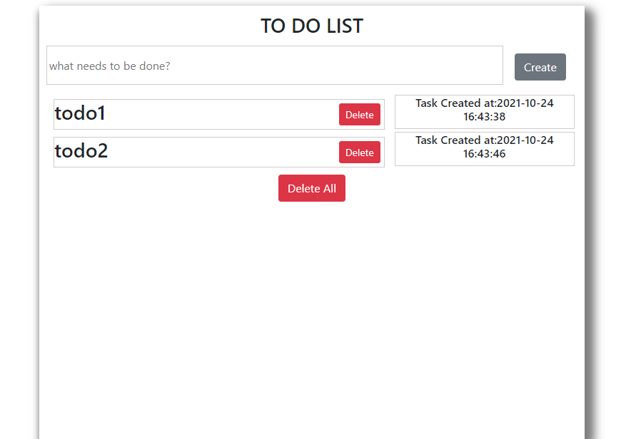

### React Todo App

* Takes input from the user as a text, stores it and displays it as a list which contains the todo items previously entered by the user.

* The user of the application can create, read, delete items from the list.

* On creating a new entry in the list, a time stamp is provided to show the time at which the item was entered in the list.

* On deleting an item from the list, instead of removing it from the display of the list, strikes off the text of the item.

* Please refer to the screenshot 

### `Prerequisites`

* Install Node JS

* Refer to https://nodejs.org/en/ to install nodejs

* Install create-react-app

* Install create-react-app npm package globally. This will help to easily run the project and also build the source files easily. Use the following command to install create-react-app

npm install -g create-react-app

* Cloning and Running the Application in local
* Clone the project into local

* Install all the npm packages. Go into the project folder and type the following command to install all npm packages

npm install
* In order to run the application Type the following command

npm start
* The Application Runs on localhost:3000

